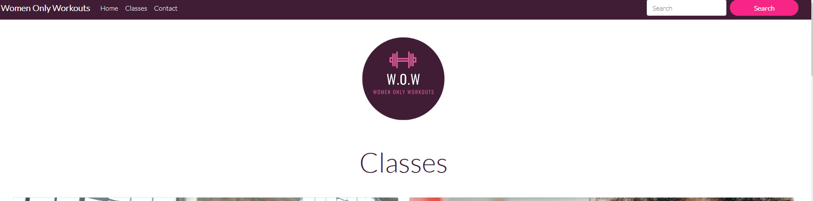
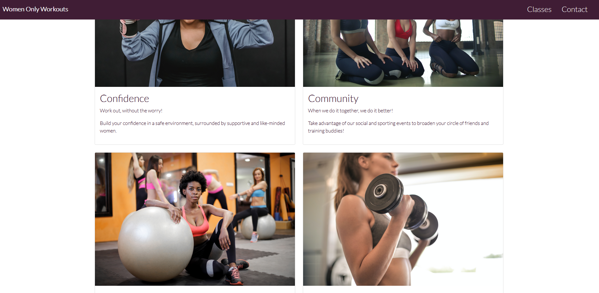
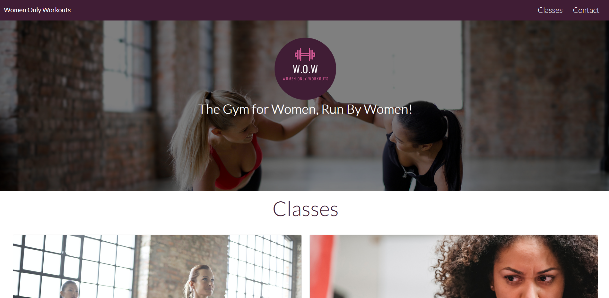
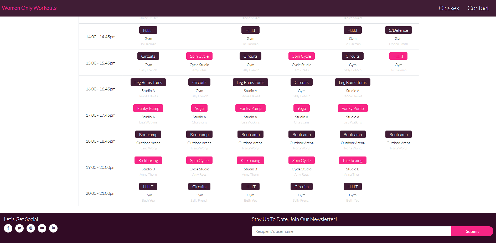
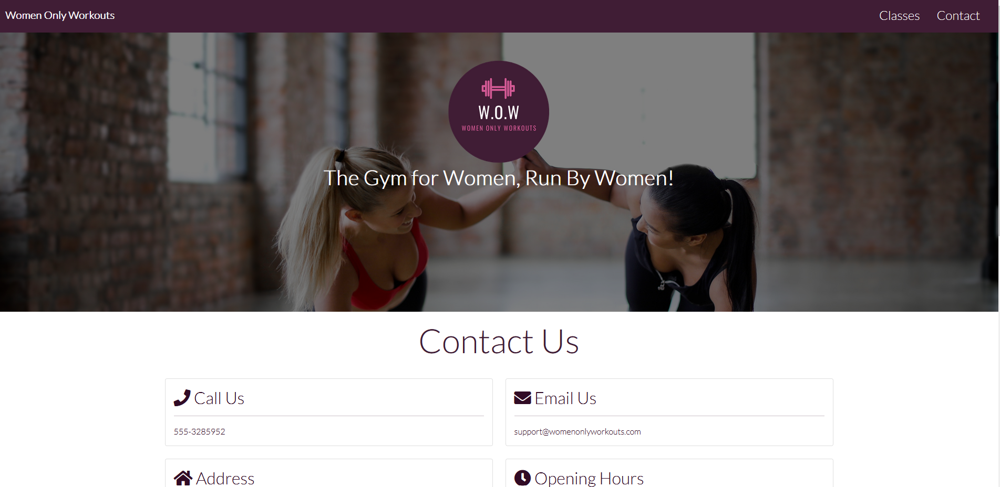

# Cerys' portfolio website; Womens Only Workouts Gym

## User-Centric Frontend Development Milestone Project 1.

Website presents an informative platform for users to find content relating to the fictional womens only gym called "Women Only Workouts". 

As part of the Code Institutes milestone project 1, the main aim of this project is to build a responsive website with HTML, CSS and Bootstrap. I have decided to use bootstrap as my framework for consistency and ease of use.

## [View live website in github pages](https://ceryslloyd.github.io/first-milestone-project/)
---

# Table of contents

- [UX](#ux)
    - [Website owner business goals](#website-owner-business-goals)
    - [User goals](#user-goals)
        - [New user goals](#new-user-goals)
        - [Returning user goals](#returning-user-goals)
        - [Website owner business goals](#website-owner-business-goals)
    - [User stories](#user-stories)
    - [Structure of the website](#structure-of-the-website)
    - [Wireframes](#wireframes)
    - [Surface](#surface)
- [Features](#features)
- [Technology](#technology)
- [Testing](#testing)
    - [Functionality testing](#functionality-testing)
    - [Compatibility testing](#compatibility-testing)
    - [Code Validation](#code-validation)
    - [User stories testing](#user-stories-testing)
    - [Issues found during site development](#issues-found-during-site-development)
    - [Performance testing](#performance-testing)
- [Deployment](#deployment)
- [Credits](#credits)
- [Screenshots](#screenshots)

# UX

## Website owner business goals

The gym owner is interested in attracting new members and retaining current members. 
It requires a platform that is:- 

- User friendly
- Attractive 
- Intuitive
- Encourages new members to join 
- Engages existing members
- Outlines specifics about the business e.g. location, opening hours, contact details, timetable. 

## User goals

### New user goals:

- User is able to clearly navigate the website to their desired location.
- User is able to locate the opening hours and contact details easily.
- User is able to see what classes are available / A timetable / schedule of classes.
- User has a glimpse of the business and what it has on offer before taking the next step and joining.
- User is able to contact the business with their enquiry via a contact form.

### Returning user goals:

- Returning user is able to see what is "going on" e.g. regularly updated events that are taking place, social events being advertised.
- Returning user is able to navigate to the timetable easily.
- Returning user is able to contact the business via a contact form.

## User stories

### As a business owner:

* I wish to present my business in a professional and informative manner that users will find easy to use.
* I wish the online presence to match the business brand.
* I would like to build relationships with new customers while engaging with and retianing current members. Ensuring that the website provides quality information to both.

### As a new customer:

* I want to know more about the business from a website that is easy to use e.g. classes on offer. Timetable of classes etc
* I want to find the contact information quickly should I need to book a class or induction and see business hours. 
* I want a map so I can see where the gym is located.
* I would like to keep informed of any offers coming up, and possibly follow the business on social media for a while before committing as a member. 

### As a returning customer:

* I would like to check the class timetable to plan my workout schedule ahead of time.
* I may need to contact the business to re-arrange a class or make a booking.
* I would like to check what's going on; for the social aspects that the gym offers e.g. Summer events.
* I may need to show my friend where the gym is using their map.

## Structure of the website

The website has been designed to be responsive and user friendly on all devices. 
The content, colours and images have been chosen in line with the business brand
The header and footer will be identical across all pages for ease of navigation and structure.
The user will have interaction in the form of links and buttons with active hover effects.

## Wireframes

To create the wireframes I used Balsamiq Wireframes.

Viewable pdf here

## Surface

### Colors

Main colours used in this project, in conjunction with the businesses brand colours provided by the logo:
* background color: #401d35
* font color: #310b25 or #fff
* testimonial colour:#310b25
* link color: #f72585
* hoover color: #f72585

### Fonts 

* As a main font I used Lato, and as a backup font sans-serif.

### Images

* Images mages from [Pexels.com](https://www.pexels.com/) and there are credited in [credits](#credits) section.

[Back to Table of contents](#table-of-contents)
___
# Features

The website consists of 3 pages:- 

- A Main/ Home page; accessible from the navigation bar or by clicking the Womens Only Workout logo on the right hand side of the Navbar.
- A classes page; which outlines the classes available and includes a timetable. Accessible from the navbar.
- A contact page; accessible from the navbar.

The website has below features:

## Navigation bar

* #### Navigation bar is located at the top of every page. Fully responsive; changes into a burger icon on medium and smaller devices.
* Navigation scheme:

    * On the left hand side of the navbar there is a logo with a href to direct user back to the home page once clicked. 
    * On the right hand side of the navbar there are three links/ burger menu for smaller devices. 
    * It contains:
        * Home
        * Classes
        * Contact

## Content

* Each webpage has different content depending on the page; see below. However the main body of the webpage is filled with content and this is consistent across all pages.

## Footer

* The footer is consistent on all pages. 
* The left hand side has social links. Each link will open in a seperate tab. 
* The right hand side has a "sign up for our newsletter" info block and button.

## Home

* ### Jumbotron

    * The jumbotron includes a full width image, overlaid with a custom/ brand logo and information about the gym; including a new members offer. 

* ### Reasons To Join Us Section

    * This section includes brand relevant images outlining 4 reasons that should inspire new members to join this gym.

* ### What's Going On Section

    * This section offers information relating to upcoming events in the form of bootstap cards. It gives an image and a brief description of the event.

## Classes

* ### Classes Section

* This section offers information on classes available at the gym. Using a bootstrap card template that provides the user with a brand relevant image, a brief description of the class and a "View Classes" button that when clicked takes them to the timetable lower down the page. The button has active hover effects. 

* ### Classes Timetable

* This section offers a colour branded class timetable that shows what classes are available on each day of the week.

## Contact

* ### Contact Us Section

* This section displays all the relevant contact information for the business e.g. phone number, email, business address and opening hours.
* It also includes a google map location of the business and a conact form allowing users to get in touch directly through the website.

##  Future implementations

* Create a members sign in page; where members can purchase tickets for events and book classes.
* Add a sign up page; where the business can recruit new member through the website and take payments.
* Create a blog to encourage enagagement with the current members, ensuring they stay active with the business.
* Add a virtual tour video to the main page; to show future members the layout.

[Back to Table of contents](#table-of-contents)
___
# Technologies used

### HTML5
* As a structure language.

### CSS
* As a style language.

### Bootstrap 
* Bootstrap@5.1.1 as a CSS framework

### Font Awesome
* As an icon library for a social links and on contact us page.

### Google fonts
* As a font resource.

### GitHub
* As a software hosting platform to keep project in a remote location.

### Git
* As a version-control system tracking.

### Gitpod
* As a development hosting platform.

### Balsamiq Wireframe
* As a wireframing tool.

### Paint
* As an image editor.

[Back to Table of contents](#table-of-contents)

___
# Testing

## Functionality testing 

Mozilla, Safari and Chrome developer tools were used throughout the project to check responsivity and to debug errors.

## Compatibility testing

Compatibility was tested on:
* Iphone 11
* HP Pavillion Laptop
* Ipad pro
Using safari, Mozilla and Chrome.

## User stories testing

### As a business owner:

I wish to present my business in a professional and informative manner that users will find easy to use.
* I wish the online presence to match the business brand.
* I would like to build relationships with new customers while engaging with current members. Ensuring that the website provides quality information to both.
* I would like to provide intuitive learning for the user while using the website.

- I wish to present my business in a professional and informative manner that users will find easy to use
    > Intuitive, user friendly design; Navbar and footer to be identical across each page allowing for intuitive learning. Present at all times.
    > 

- I wish the online presence to match the business brand.
    > Use custome brand logo and corresponding colours to create a brand relevant website. 

- I would like to build relationships with new customers while engaging with and retianing current members. Ensuring that the website provides quality information to both.
    > Social media links to be added to the footer of each page.
    > Brand specific images to be added to the content of each page with relevant information pertaining to the business.

### As a new customer:

- wish to find information about personal trainer and check her/his qualifications.
    > User can see essential description on the home page. More information can be find in about page.

- I want to know more about the business from a website that is easy to use e.g. classes on offer. Timetable of classes etc
    > Give the use information about the business and what it has on offer in the form of images and text relevant to each page. 
    > Navbar and footer present on every page and identical in information providing unification and ease of use.

- I want to find the contact information quickly should I need to book a class or induction and see business hours.
    > contact page with all relevant information, available directly from the navbar.
    > Social media channels are also available in the footer of each page.

- I want a map so I can see where the gym is located.
    > Google map element in the contact us page.

- I would like to keep informed of any offers coming up, and possibly follow the business on social media for a while before committing as a member.
    > Offers for new members displayed on the main/ index page to entice new members.
    > Social links to the footer.

### As a returning customer:

I would like to check the class timetable to plan my workout schedule ahead of time.
* I may need to contact the business to re-arrange a class or make a booking.
* I would like to check what's going on; for the social aspects that the gym offers e.g. Summer events.
* I may need to show my friend where the gym is using their map.

- I would like to check the class timetable to plan my workout schedule ahead of time.
    > A timetable of classes available within the class page on the navbar.

- I may need to contact the business to re-arrange a class or make a booking.
    > contact us page with relevant contact information and a contact us form so user can contact business directly from the website,

- I would like to check what's going on; for the social aspects that the gym offers e.g. Summer events.
    >a what's going on element within the main page to keep current members engaged with the business and show new/ perspective members that the business regularly holds events.

- I may need to show my friend where the gym is using their map.
    > map located on the contact us page showing the location of the business as well as business address allowing for the use of satnav should the friend wish to join.

---
## Issues found during site development

* #### Navbar Alignment.

I used [bootstrap](https://getbootstrap.com/docs/5.0/components/navbar/#toggler) to create the navbar and then customised the css to apply the desired look. However I could not get the text to sit to the right hand side of the page.
Using mozzilla developer tools I applied *margin-right* elements and *padding* but this caused problems with the responsiveness in smaller screens. I tried *justify-content* elements and they didn't work either. 

>I read bootstraps documentation on [Spacing](https://getbootstrap.com/docs/5.0/utilities/spacing/) and [flex](https://getbootstrap.com/docs/5.0/utilities/flex/) but didn't find the answer.

>I watched a you-tube tutorial by [RTECH-INFO](https://www.youtube.com/watch?v=ozCItmwbgvc) which outline the *me-auto* and *ms-auto* functions and changed the code within github to follow these new rules.

Code before applying the new rule.
 
Code after applying the new rule.
 

> After gaining more experience with bootstrap I also altered the code snippet that bootstrap provided; removing the search bar. I applied custom css to the navbar for styling, using the Mozzilla developer to ensure that all code was responsive. Below is an image of the final Navbar.

* #### Navbar Alignment.

I orignially used the same style template as the [Code Institute Love Running Project](https://learn.codeinstitute.net/courses/course-v1:CodeInstitute+CSE101+2020_Q2/courseware/be0e510a3aca4bccb6e0bba4cf7cf06b/6eb8cfc87bfd434a87861a844e00b655/) with the *col* and *row* system to try and replicate the writing in line with the image for the classes pages and the home page of my project. 

It lead to a whole host of responsive design issues when trying to float the *cols* left and right. 

> I watched a tutorial to better understand the relationship between *rows and cols* [Acedemind](https://www.youtube.com/watch?v=qmPmwdshCMw)

> I rewatched Code Institute videos regarding *div and span* rules I also read the [containers information](https://getbootstrap.com/docs/5.0/layout/containers/#how-they-work) available at Bootstrap, to completley get to grips with the grid system. 

> After gaining more experience with bootstrap I became aware of the [Grid cards](https://getbootstrap.com/docs/4.5/components/card/#grid-cards) and their responsivity built in. I used custom styling using the mozzilla developer to ensure that the code was responsive on all devices. 

* #### Footer Newsletter Sign Up, Button Missing.

I orignally tried to mimic/ adapt the code from the the [Code Institute- Rosie Project](https://learn.codeinstitute.net/courses/course-v1:codeinstitute+FE+2017_T3/courseware/616289d66b5641a3808cc43e53842695/b51f7b8b815c4bcd9979d2281b6d97a9/) for the footer as I liked the elements grouping, but the design I was working on didn't really call for the quantity of *cols* used.

>I didn't want to leave the remaining space in the footer blank... usually there would be room here for the contact details, but I have included a contact page in the design. I opted to place a "sign up to our newsletter" email input into this element to encourage new and existing members to sign up for further information from the business.

I added the code from the *navbar search bar* that I had originally installed from [bootstrap](https://getbootstrap.com/docs/5.0/components/navbar/#toggler), and was going to further edit the code to apply to this, but the button didn't appear. 

I then installed a button element that I had used for the Classes page [testing_issue_3](assets/md_images/footerbutton2.png) 

This caused issues with responiveness and didn't look right. 

>I researched other options available for *input and button* options using [bootstrap add ons] (https://getbootstrap.com/docs/5.0/forms/input-group/#button-addons) and that worked. I changed the *col* settings in the footer from *col-sm-8, col-sm-4* to *col-sm-6, col-sm-6* to allow for the button to sit well in the footer.

[testing_issue_3](assets/md_images/footerbutton3.png)

> I customised the css and here is the finished button

[testing_issue_3_resolved] (assets/md_images/footerbutton4.png)

## Performance testing

To test performance I run the  [Lighthouse](https://developers.google.com/web/tools/lighthouse/) developer tool.
I plan to edit the photos to reduce loading time and increase the performance of the webiste.

[Website Performance](assets/md_images/performance.png)
[Best Practices](assets/md_images/best-practices.png)

## Code Validation
 Throughout the project I have used 2 validators to check and validate code
 
 * [W3C CSS Validator](https://jigsaw.w3.org/css-validator/) to validate CSS
 * [Nu Html Checker](https://validator.w3.org/) to test HTML

[Back to Table of contents](#table-of-contents)

___
# Deployment

This project will be deployed through Github.

Gitpod was the development tool for writing the code: Git add and Git Commit commited all changes to git.
The push command in Gitpod was used to save changes in GitHub.

To deploy the project I had to:

* Log in to GitHub and click on repository to deploy ([Repository](https://github.com/CerysLloyd/first-milestone-project))
* Use the `Settings`button on the command line above the green gitpod button; it has a cog icon.
* Scroll down the page to the 'GitHub Pages' section, almsot near the bottom of the page.
* Inside a highlighted bar: Pages settings now has its own dedicated tab! Check it out here!, click the href link.
* At the top of the page there will be a highlighted href link Your site is published at https://ceryslloyd.github.io/first-milestone-project/
* click and it opens in a new page. 

[Back to Table of contents](#table-of-contents)
___
# Credits

* To complete this project I used Code Institute student template: [gitpod full template](https://github.com/Code-Institute-Org/gitpod-full-template)

* Ideas and knowledge library:

    * [w3schools.com](https://www.w3schools.com)

    * [css-tricks.com](https://css-tricks.com/)

    * [Understanding row and cols](HTTPS://WWW.YOUTUBE.COM/WATCH?V=QMPMWDSHCMW)

    *

    * [getbootstrap.com/docs](https://getbootstrap.com/)
        Used for:-
        * CDN via jsDelivr
        * Navbar
        * Jumbotron / this also came from the Code Institute tutorial for Whiskey Drop
        * Burger Menu

### Code

* Timetable: [Timetable](https://www.bootdey.com/snippets/view/time-table#html)
* Testimonials idea: [Love Running](https://learn.codeinstitute.net/courses/course-v1:codeinstitute+FE+2017_T3/courseware/616289d66b5641a3808cc43e53842695/b51f7b8b815c4bcd9979d2281b6d97a9/?child=first )
* Bootstrap: [Navbar](https://getbootstrap.com/docs/5.1/components/navbar/)
* Bootstrap: [Burger Bar](https://getbootstrap.com/docs/5.0/components/navbar/#external-content)
* Bootstrap: [Card Grid](https://getbootstrap.com/docs/5.1/components/card/#grid-cards)
* Bootstrap: [Footer Button](https://getbootstrap.com/docs/5.0/components/navbar/#toggler)
* Code Institute: [Jumbotron](https://learn.codeinstitute.net/courses/course-v1:codeinstitute+FE+2017_T3/courseware/a4b90d17e5c94220a0f83f00ce7fa606/4b3b1b062b01424997c8fd052e177b8e/?child=first)

### Content:
*  General content: My own creation

### code for the insertion of a map:
* [Bootsnip](https://bootsnipp.com/snippets/VgVDB)

### Map:
* [Google maps](https://www.google.com/maps/embed?pb=!1m18!1m12!1m3!1d2481.9141312143433!2d-3.680686883611361!3d51.53313477963932!2m3!1f0!2f0!3f0!3m2!1i1024!2i768!4f13.1!3m3!1m2!1s0x486e6f482f6c14e9%3A0x1d6f01551dcb61f4!2s4%20Commercial%20St%2C%20Kenfig%20Hill%2C%20Bridgend%20CF33%206DH!5e0!3m2!1sen!2suk!4v1631707601060!5m2!1sen!2suk)
 
### Images:

#### Pexels.com:
* [boxfit](https://www.pexels.com/photo/strong-plump-black-female-exercising-with-punching-bag-6456170/)
* [bootcamp]
* [community](https://www.pexels.com/photo/three-women-kneeling-on-floor-866023/)
* [confidence](https://www.pexels.com/photo/excited-young-black-sportswoman-showing-biceps-after-boxing-training-6456233/)
* [core](https://www.pexels.com/photo/three-women-s-doing-exercises-863977/)
* [empowerment](https://www.pexels.com/photo/young-ethnic-woman-with-fit-ball-sitting-on-floor-while-training-in-modern-gym-3768593/)
* [ladies-header](https://www.pexels.com/photo/young-slender-female-athletes-giving-high-five-to-each-other-while-training-together-in-sports-club-3768722/)
* [legsbumsandtums](https://www.pexels.com/photo/group-of-women-doing-exercise-inside-the-building-3775566/)
* [party](https://www.pexels.com/photo/woman-in-silver-v-neck-long-sleeved-dress-3394310/)
* [strength](https://www.pexels.com/photo/woman-in-gray-sports-bra-holding-black-dumbbell-3757376/)
* [warrior](https://www.pexels.com/photo/woman-doing-crossfit-2294400/)
* [yoga]

* Lauren, Kirsty, Lisha and rainbow run photos are all personal images from my own collection. 

# Screenshots

## Project screenshots

[Back to Table of contents](#table-of-contents)
___

